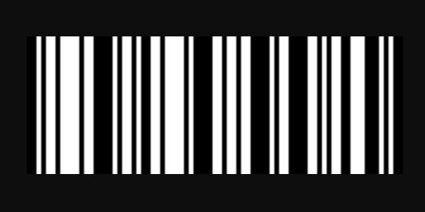

# Headless Apps with Project Firefly

This codelab will guide you through creating a headless app using Project Firefly.   

The app will generate a code128 barcode based on the user provided value. It's a simple app that can be used and adapted for different use cases.
 
* A demo is available [here](https://s3.amazonaws.com/adobe-cna/ringel/adobeio-cna-barcode-1.0.0-beta/index.html) for preview with a minimalistic UI.
* The project source code of the codelab is also available [here](https://github.com/AdobeDocs/adobeio-codelabs-barcode/blob/master/lessons/source/my-barcode-app.zip).

   

A pre-requisite of the codelab is to have access to [Project Firefly](https://github.com/AdobeDocs/project-firefly) or at least a namespace in Adobe I/O Runtime. 
If you don't have access, please [request trial access](https://github.com/AdobeDocs/adobeio-runtime/blob/master/overview/request_a_trial.md).  

Start the first lesson: [Bootstrap a headless app](/lessons/bootstrap.md).