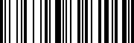

# Headless Apps with Project Firefly

This codelab will guide you through creating a headless app using [Project Firefly](https://github.com/AdobeDocs/project-firefly).   

The app will generate a code128 barcode based on the user provided value. It's a simple app that can be used and adapted for different use cases.
 
* The project source code of the codelab is available [here](https://github.com/AdobeDocs/adobeio-codelabs-barcode/blob/master/lessons/source/my-barcode-app.zip).
* [Live demo](https://ringel.adobeioruntime.net/api/v1/web/my-barcode-app-0.0.1/barcode?value=adobe). You should see a barcode image which is rendered with the value `adobe`.  

  

Next: [Requirements](/lessons/requirements.md)