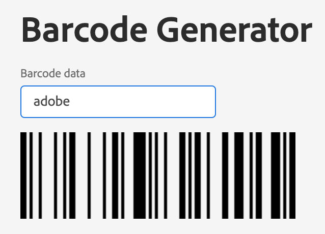

## Well done

**You've reached the end**. This is all it takes to build a Firefly Headless App.
The barcode action can be used for example to send a receipt via email to customers after a checkout.   

In the next codelab, we'll show you how to integrate a UI with React Spectrum and CI/CD with Github Actions into a Firefly App.

